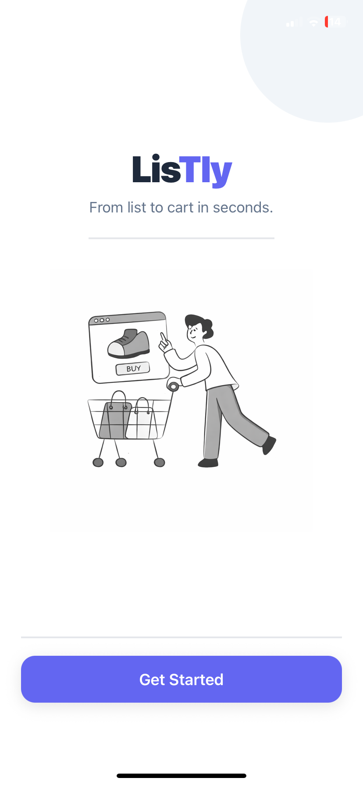
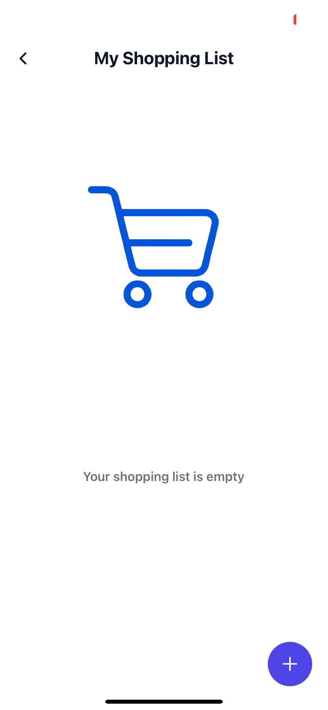
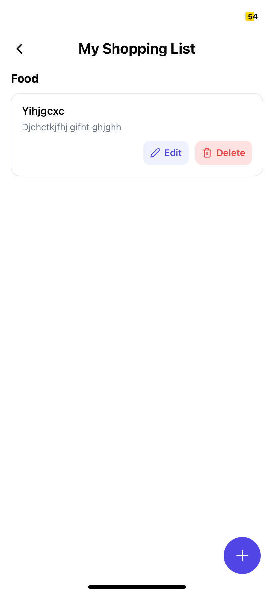

## Project Description ##

React Native (Expo) shopping list application that helps users manage items by category, add descriptions, edit items, and delete them using intuitive
swipe gestures. The app uses Redux Toolkit for state management and Expo Router for navigation.

## Featrures 

- Add, edit, and delete shopping items
- Categorize items (Food, Clothes, Cosmetics)
- Optional item descriptions
- Swipe-to-delete gestures

## Tech Stack

- React Native
- Expo
- Expo Router
- Redux
- Expo Vector Icons


## Project Structure


├── app/
│   ├── index.tsx
│   ├── ListPage.tsx
│
├── store/
│   ├── shoppingSlice.ts
│   ├── store.ts
│
├── assets/
│   └── images/
│       └── ii.png
│
├── README.md
└── package.json


1. Install dependencies

   ```bash
   npm install
   ```

2. Start the app

   ```bash
   npx expo start
   ```


## Screenshots

### Home Screen



### Empty List



## List Screen


